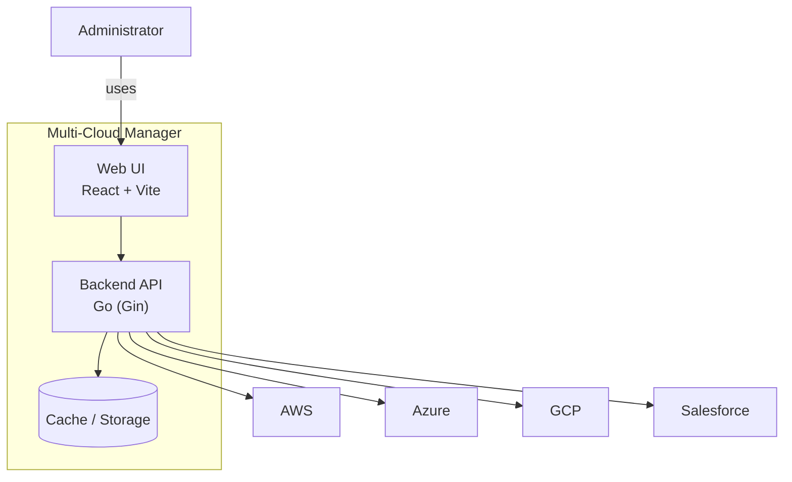

<!-- This file previously contained Mermaid diagrams. It now references the canonical Mermaid source `diagram.mmd`. -->

# Multi-Cloud Manager — C4 (Mermaid)

This file is kept for convenience. The canonical single-source for Mermaid diagrams is `diagram.mmd`.

Canonical source: [diagram.mmd](diagram.mmd)

If you edit diagrams, update `diagram.mmd` (the Mermaid source) and update `architecture/exports/` by running the local render command or waiting for the CI renderer.

## Rendered Mermaid (convenience — copy of canonical)

